# AuTuber

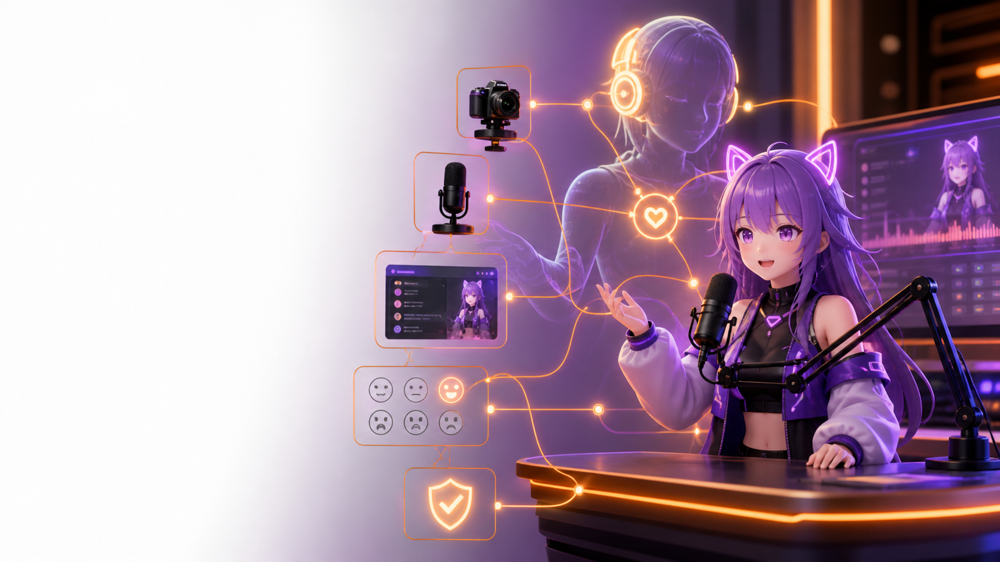

AuTuber is an AI desktop sidekick for VTubers and livestream creators.

It watches your live stream context, understands what is happening, and helps your stream setup react at the right moment. It can trigger VTube Studio expressions, prepare OBS actions, show overlay messages, track recent actions, and keep everything behind local safety rules so your stream does not turn into an unsupervised chaos machine.

AuTuber is built for creators who want AI assistance that does more than chat. It helps operate the stream, but only through controlled actions that can be validated, limited, logged, and reviewed.

## Watch The Demo

[](https://youtu.be/aayni0CC_4Q)

YouTube Link: [https://youtu.be/aayni0CC_4Q](https://youtu.be/aayni0CC_4Q)

See the full flow: live context capture, AI action planning, safety validation, VTube Studio reactions, OBS/overlay behavior, and the low-latency model monitor.

## In Simple Terms

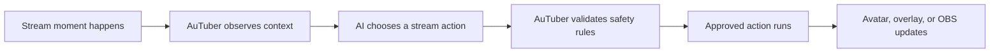

## Why Streamers Might Want This

Streaming is a lot to manage at once.

You are talking, reacting, reading chat, changing scenes, managing overlays, checking audio, and trying to keep your energy up. If you are a VTuber, you may also be manually pressing hotkeys for expressions, poses, props, and effects.

AuTuber helps with the small production moments that make a stream feel alive.

It can help your stream setup:

* trigger avatar expressions when the moment calls for it
* suggest or prepare OBS scene/source changes
* show short overlay messages
* avoid repeating the same reaction too often
* keep a visible log of what happened and why
* keep risky actions behind confirmation rules

The goal is not to replace the streamer. The goal is to give the streamer an extra pair of paws on the control panel.

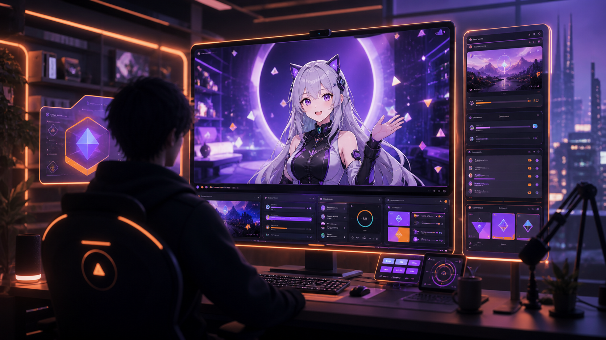

## Product Vision

AuTuber is designed to become a local AI stream-control layer.

The long-term vision is:

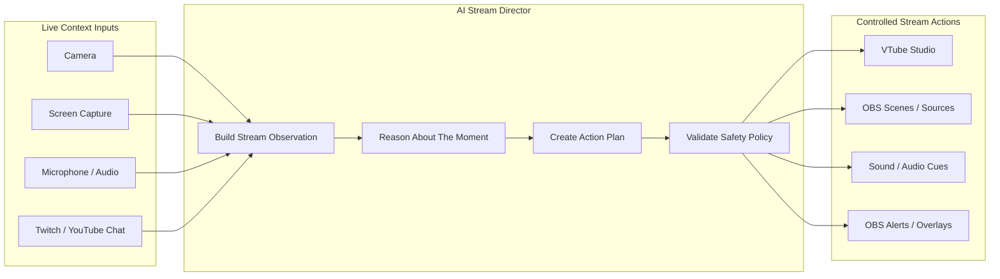

The intended direction is:

```text
Camera + Screen + Audio + Twitch/YouTube Chat
  -> AI understands the stream moment
  -> AuTuber validates the action
  -> OBS, VTube Studio, overlays, alerts, and sound react safely
```

This makes AuTuber more than an avatar hotkey tool. The goal is to build a safe local controller for the whole creator production environment.


AuTuber is also intended to support many kinds of creator workflows, not only VTubing. The same safe stream-control loop can apply to gaming streams, podcasts, educational streams, esports-style productions, live panels, and AI-assisted content operations.

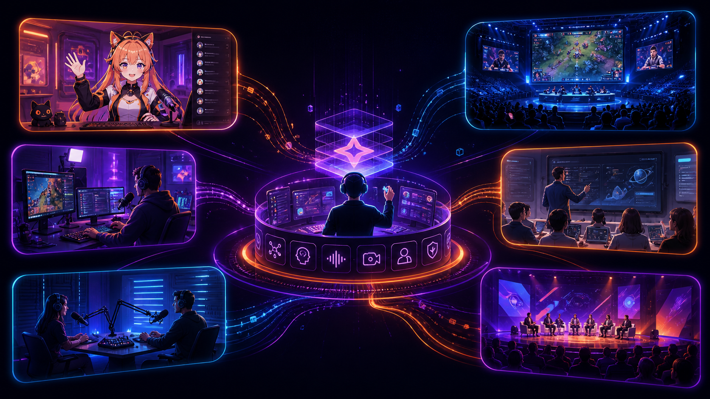

## What Works Today

AuTuber is currently an early desktop alpha.

Today, it can:

* connect to VTube Studio
* authenticate with the VTube Studio API
* load available VTube Studio hotkeys
* maintain a VTube Studio automation catalog with cue labels and per-hotkey overrides
* trigger safe avatar hotkey actions
* attempt automatic OBS and VTube Studio service activation on startup
* read OBS connection, scene, and source state
* configure and run an AFK overlay helper against a selected OBS scene/source
* capture camera, screen, and audio context from the dashboard
* send structured stream context to the currently configured OpenAI-compatible model provider
* run a persistent model-monitor loop for low-latency reaction decisions
* use shared observation state instead of forcing every task into one giant prompt
* parse model responses into typed action plans
* validate actions before execution
* enforce cooldowns so reactions do not spam
* show live monitor status plus the latest model request/response pair, reviewed actions, and execution results
* reach roughly 600 ms model-response time in optimized demo conditions

OBS automation is intentionally conservative in the current alpha. Reading OBS state works, and OBS actions are part of the action system, but production-impacting actions like scene/source changes are designed to stay confirmation-gated unless the user explicitly enables stronger automation.

### Current Desktop Alpha

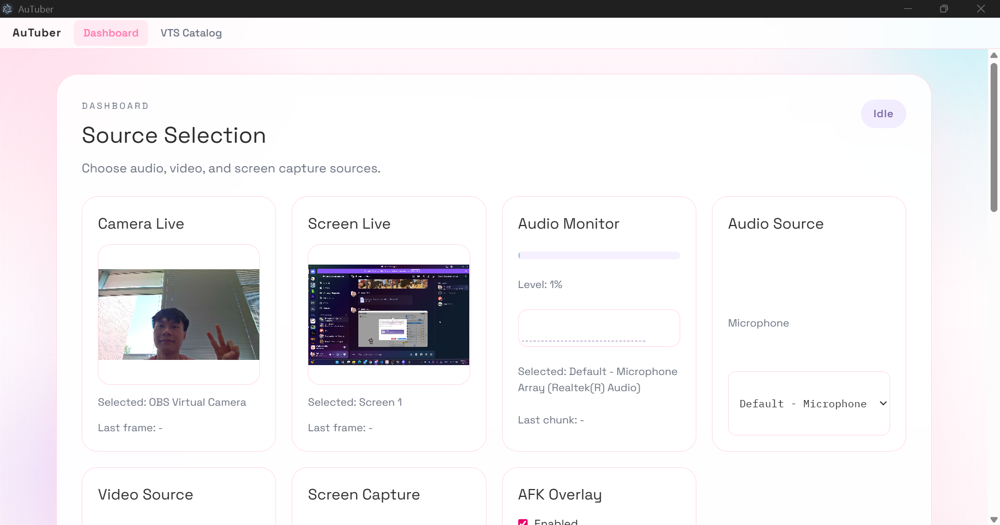

The current app includes source selection for camera, screen, and audio capture, along with live status surfaces for the local agent loop.

### VTube Studio Integration

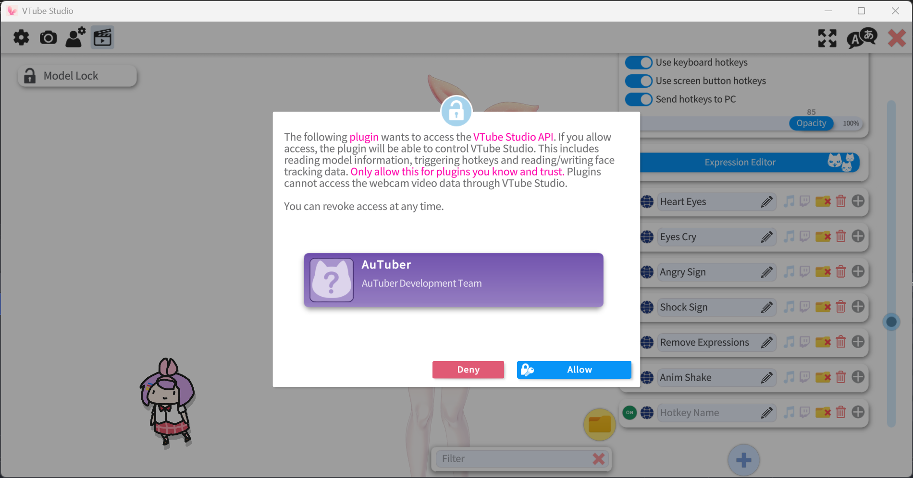

AuTuber connects to VTube Studio through the VTube Studio API, authenticates as a plugin, reads available hotkeys, and can trigger approved avatar actions.

## What Is Still Planned

AuTuber is not finished yet. The current alpha focuses on proving the local agent loop:

```text
Observe -> Ask AI -> Parse Action Plan -> Validate -> Execute Safe Action -> Log Result
```

Planned or maturing areas include:

* Twitch and YouTube chat ingestion
* richer OBS scene/source automation UI
* OBS alerts and overlay helpers
* audio/soundboard actions
* better automatic VTube Studio hotkey intent mapping
* smoother first-time setup
* packaged releases for non-developers
* lower-latency multimodal inference
* more formal latency benchmarking across model providers
* configurable fast-loop and director-loop model routing
* better UI controls for choosing which tasks run on fast vs. deep reasoning loops
* richer approval and review workflows
* better creator-facing presets
* stream-safe automation profiles

## What AuTuber Will Not Do By Default

AuTuber is safe by default.

By default, it should not:

* give the AI unrestricted desktop control
* execute arbitrary model-generated commands
* expose your model API keys to the renderer
* switch OBS scenes without policy approval
* hide or show OBS sources without policy approval
* spam the same avatar reaction repeatedly
* silently ignore blocked actions

When an action is blocked, AuTuber logs the reason so the creator can review what happened.

## What Makes AuTuber Different

Most AI stream tools are chatbots, caption helpers, or content generators.

AuTuber is a local stream controller.

A chatbot produces text. AuTuber produces validated stream actions.

That means the AI can suggest an actual production action, such as triggering a VTube Studio expression, showing an overlay message, or preparing an OBS source change. AuTuber checks that action before running it.

Unlike a traditional AI chatbot or interview simulator, AuTuber connects AI reasoning to real-time local tool execution: the model plans stream actions, but the desktop app validates and safely executes them through OBS and VTube Studio.

The model does not get direct unsafe control over your desktop. It only gets access to controlled tools that AuTuber exposes, such as:

* trigger a VTube Studio hotkey
* show an overlay message
* log an event
* suggest an OBS scene or source action
* do nothing when no action is needed

This makes AuTuber closer to an MCP-style controller for streaming tools than a normal chat assistant, but with creator safety and local validation built in.

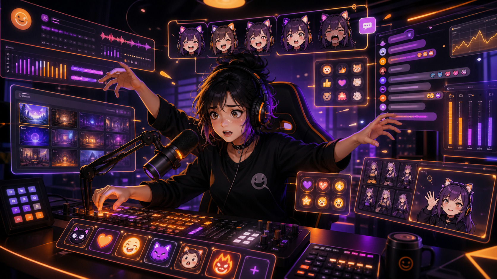

## Built For Live Latency

Live streaming does not wait for slow AI.

A response that arrives after 10 seconds might be impressive in a benchmark, but it is too late for a facial reaction, a chat moment, or an OBS production cue. AuTuber was designed around the idea that stream actions need to happen while the moment still matters.

To make that practical, AuTuber does not rely on one giant model request for every decision. The system can split work into multiple focused model loops:

* fast visual/emote checks for immediate avatar reactions
* audio/transcript checks for speech-aware context
* screen/OBS checks for production state
* longer-context director checks for broader stream decisions

All of these loops share structured observation state and still pass through the same local action validator.

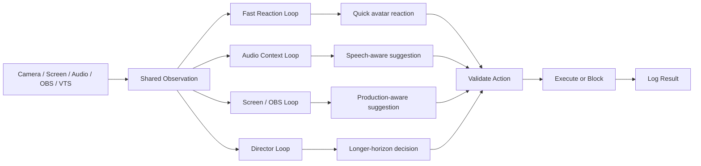

In our demo branch, focused model requests were optimized heavily enough to reach roughly **600 ms model-response time** on a normal internet connection of about **75 Mbps down / 70 Mbps up**. Actual latency depends on the model provider, hardware, network, prompt size, media size, and selected capture settings, but the architecture is designed to keep fast reactions fast instead of making every action wait for the slowest long-context request.

## Safety Model

AuTuber is designed around one rule:

```text
The AI suggests. AuTuber validates. The creator stays in control.
```

Before any model-generated action runs, AuTuber checks:

* whether the action has the correct structure
* whether the action type is allowed
* whether the action is blocked by policy
* whether the hotkey, source, or scene exists
* whether the action was triggered too recently
* whether the current autonomy level allows it
* whether the action requires confirmation

Safe actions, like avatar expressions, can run automatically.

Riskier actions, like OBS scene changes or source visibility changes, can require confirmation.

## How The Runtime Loop Works

AuTuber uses a shared observation state and one or more model loops.

The simplest path is:

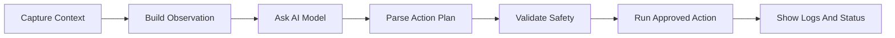

For live use, AuTuber can also split work into focused model requests, as described in Built For Live Latency, so fast reactions do not wait for slower long-context reasoning.

## Example Stream Moment

Imagine your VTube Studio model has these hotkeys:

```text
Wave
Laugh
Surprise
Angry
Excited
Heart Eyes
```

During a stream, AuTuber captures the current context and sends a structured summary to the model.

The model may decide:

```text
The streamer looks surprised and the transcript suggests something unexpected happened.
Trigger the Surprise hotkey.
```

AuTuber then checks:

```text
Is Surprise an available hotkey?
Is VTube Studio connected?
Is this action allowed?
Was Surprise triggered too recently?
Is this safe to run automatically?
```

If everything passes, the avatar reacts.

If something fails, the action is blocked and logged instead.

### Reaction Demo Screenshots

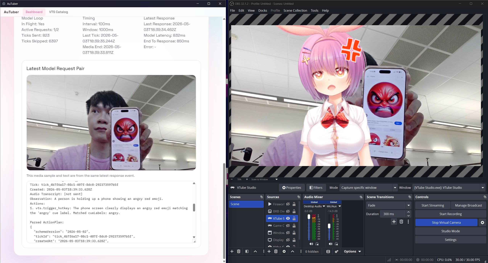

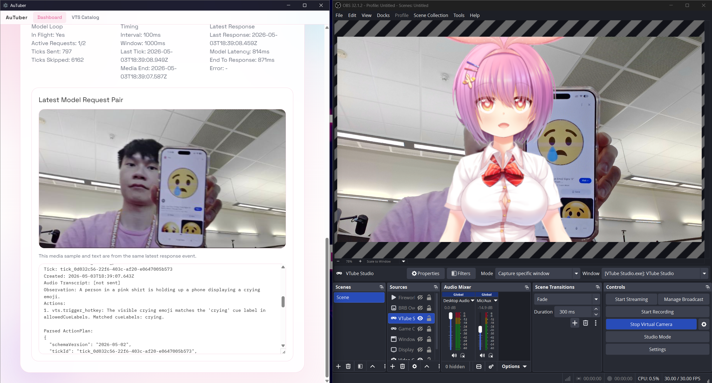

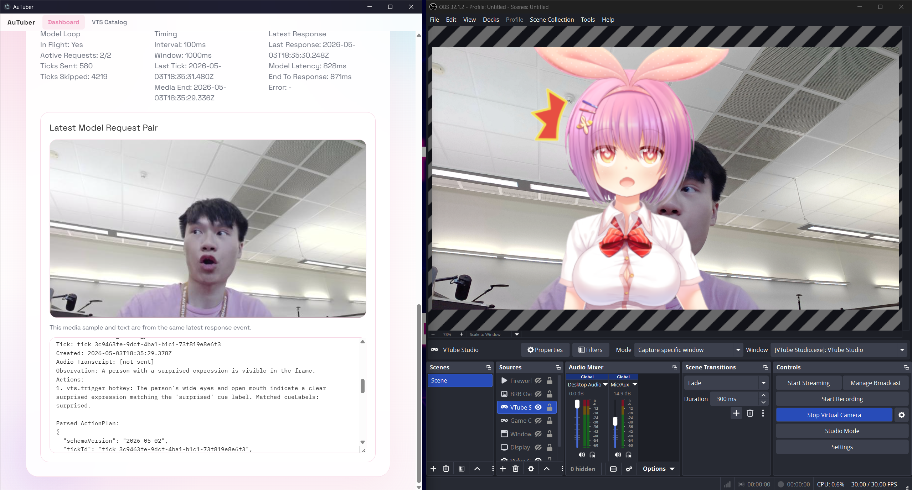

## Example Production Moment

Imagine OBS is connected and AuTuber can see the current scene and source state.

The model may suggest:

```text
The streamer appears to be away from the desk.
Show an AFK overlay or prepare a BRB scene transition.
```

AuTuber then checks:

```text
Is OBS connected?
Is this OBS action allowed?
Does this action require confirmation?
Is the target scene or source valid?
Is this action blocked by the current autonomy level?
```

If the policy allows it, the action can run.

If confirmation is required, the action is held or blocked instead of silently changing the stream.

### BRB / AFK Overlay Demo

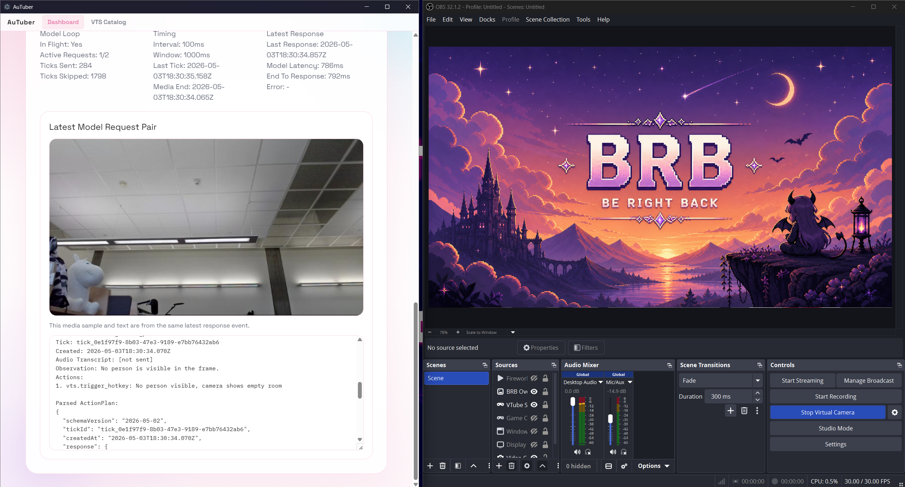

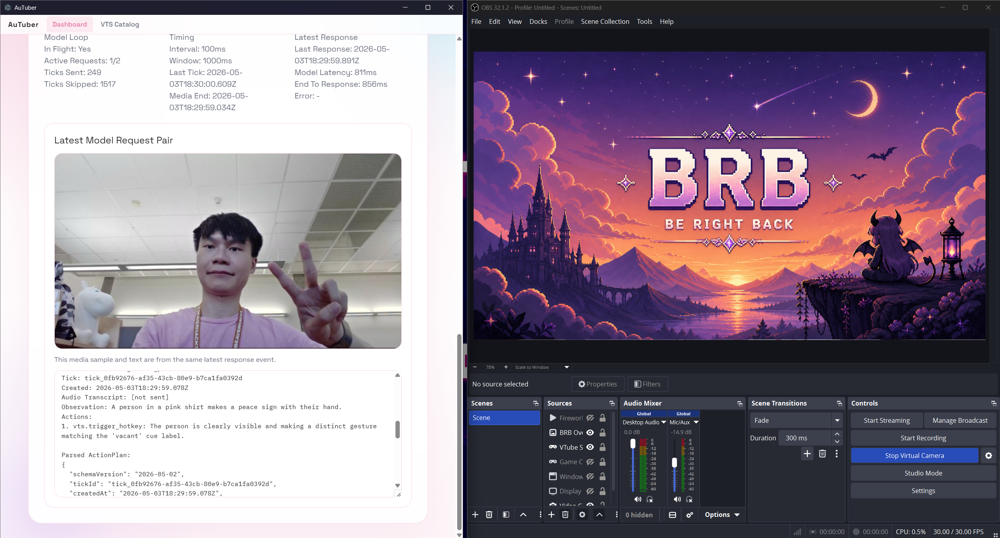

## Example Use Cases

AuTuber can be useful for:

* reactive VTuber expressions during gameplay
* stream-safe avatar gestures during chatting segments
* automated “be right back” or AFK-style overlays
* logging funny or important stream moments
* suggesting OBS scene/source changes during production
* experimenting with AI-assisted stream direction
* testing multimodal local agents with real creator tools

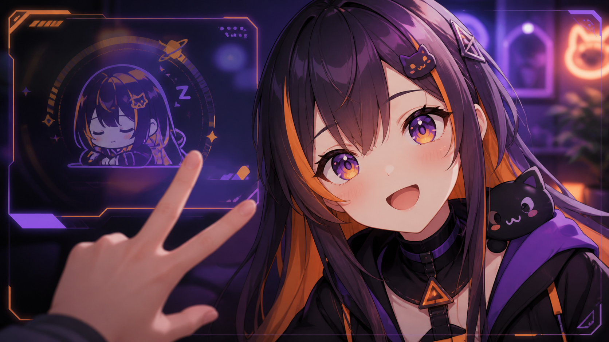

## Current Alpha Status

AuTuber is an early alpha for technical creators, developers, and AI-streaming experimenters.

It is not yet a polished one-click consumer app, but the core architecture is designed around real product use: visible controls, local policy, logs, validation, and safe defaults.

The current renderer shell is intentionally narrow. Right now the main surfaced views are:

* `Dashboard`: source selection, live previews, AFK overlay configuration, model-monitor controls, and latest response visibility
* `VTS Catalog`: VTube Studio connection/authentication, hotkey catalog review, cue-label management, and trigger testing

Current strengths:

* VTube Studio connection, authentication, and hotkey catalog control
* camera/screen/audio capture pipeline with live previews
* persistent model-monitor service for continuous reactions
* structured AI action plans
* latency-aware model request splitting
* optimized fast reaction loop tested around 600 ms model-response time in demo conditions
* local action validation, cooldowns, and safety rules
* OBS state inspection plus AFK overlay helper automation
* latest-response visibility for debugging and review

Still maturing:

* smoother first-time setup
* packaged releases for non-developers
* better automatic hotkey intent mapping
* broader OBS automation UI and explicit connection controls
* richer approval/review workflows
* lower-latency model inference across more setups
* more polished creator-facing controls across settings, logs, and status
* Twitch and YouTube chat integration
* sound and alert action support

If you are comfortable running a developer build, you can try it now.

If you want a plug-and-play streamer app, follow the project and check back as releases mature.

## Requirements

For the current alpha, you will generally need:

* VTube Studio
* OBS Studio, optional but recommended
* Node.js
* pnpm
* a reachable OpenAI-compatible model endpoint
* a camera and/or microphone if using live context capture

AuTuber is designed around OpenAI-compatible model APIs, so it can work with local, self-hosted, or remote model providers depending on your setup.

The current alpha is still developer-oriented here: the default provider entry is defined in `electron/src/main/services/model/model-provider-store.ts`, so model setup is not yet a polished end-user settings flow.

## Quick Start

```bash
pnpm install
pnpm dev
```

Then:

1. Open AuTuber.
2. Open the `VTS Catalog` tab and connect/authenticate VTube Studio.
3. Return to `Dashboard` and choose your camera, screen, and microphone sources.
4. Optionally point the AFK overlay helper at an OBS scene/source if OBS is available.
5. Confirm the configured model endpoint in `electron/src/main/services/model/model-provider-store.ts` matches your local setup.
6. Click `Start Service` to begin the live model monitor.
7. Watch the latest response panel to see what the model suggested, what local review decided, and what actually executed.

## Recommended First Test

For the first run, keep things simple:

1. Start VTube Studio.
2. Load a model with a few obvious hotkeys, such as wave, laugh, and surprise.
3. In `VTS Catalog`, connect AuTuber to VTube Studio and authenticate the plugin.
4. Refresh the hotkey catalog and confirm that AuTuber can see the hotkey list.
5. In `Dashboard`, select a camera source with a clear face view.
6. Start the model monitor service.
7. Check the latest response/output panel for the suggested action and execution result.

This confirms that the model endpoint, VTube Studio connection, capture path, and action validation loop are working before using it during a real stream.

## Privacy And Local Control

AuTuber is designed as a local-first desktop app.

OBS, VTube Studio, capture controls, action validation, and safety policy run on your machine. Model requests only receive the context needed for the configured analysis flow, and secret values such as API keys, OBS passwords, and VTube Studio auth tokens should stay in the privileged main process.

Capture sources are user-controlled, and logs should never store raw screen frames, raw microphone audio, or secret values.

## Built With

* Electron
* TypeScript
* React
* Node.js
* VTube Studio API
* OBS WebSocket
* OpenAI-compatible model APIs
* local camera/audio/screen capture
* structured action-plan validation
* NVIDIA Nemotron 3 Nano Omni experimentation
* LM Studio/self-hosted inference experimentation
* remote H200 inference experimentation

## Nemotron And Agent Architecture

AuTuber was designed around multimodal agent reasoning.

Instead of using an AI model only as a text chatbot, AuTuber uses the model as a planner inside a local tool-control loop:

```text
Observation -> Reasoning -> Structured Plan -> Local Validation -> Tool Execution
```

The observation can include:

* camera context
* screen context
* audio/transcription context
* OBS state
* VTube Studio state
* available avatar hotkeys
* recent action history
* cooldown state
* local runtime policy

This allows models such as Nemotron to reason about the live stream moment and choose an appropriate action.

The system is intentionally designed like a safe local controller: the model can request tool actions, but AuTuber decides whether those actions are valid and safe.

## Architecture

AuTuber separates the desktop app into clear trust boundaries:

```text
Electron Renderer
  user interface, setup, status, logs, controls

Preload Bridge
  typed IPC surface between UI and main process

Electron Main Process
  settings, secrets, model calls, OBS/VTS services, validation, execution

Hidden Capture Window
  browser media APIs for camera, screen, and audio capture

Local Streaming Apps
  OBS Studio and VTube Studio

Model Provider
  Nemotron or another OpenAI-compatible/self-hosted model endpoint
```

The renderer never receives raw secrets and never directly controls privileged services. Model-generated behavior must pass through parsing, schema validation, policy validation, and action execution services.

## Screenshot Gallery

| Source Selection                                                            | VTube Studio Auth                                          |
| --------------------------------------------------------------------------- | ---------------------------------------------------------- |
|  |  |

| Angry Reaction                                                     | Crying Reaction                                                      |
| ------------------------------------------------------------------ | -------------------------------------------------------------------- |
|  |  |

| Surprised Reaction                                                         | BRB Overlay                                                     |
| -------------------------------------------------------------------------- | --------------------------------------------------------------- |
|  |  |

## Project Map

* [SPEC.md](./SPEC.md): product contract, launch scope, and runtime boundaries
* [docs/architecture.md](./docs/architecture.md): system overview with diagrams
* [docs/setup.md](./docs/setup.md): contributor and operator setup
* [docs/security.md](./docs/security.md): trust boundaries and secret handling
* [docs/standards/adding-features.md](./docs/standards/adding-features.md): how to add features without breaking architecture
* [docs/references/releases.md](./docs/references/releases.md): release and GitHub publishing workflow

## Repository Structure

```text
electron/    desktop app, services, renderer, preload bridge
docs/        product, architecture, security, standards, references
models/      prompts and provider notes
assets/      stream-facing art assets
samples/     curated local media for verification
scripts/     repo-level helper scripts
```

## Test Assets

The `samples/` directory is intentionally kept in the repository as a lightweight verification pack.

It gives contributors and reviewers a quick way to test capture, transcription, model, and action-plan flows without recording new media first.

## Development Commands

```bash
pnpm install
pnpm dev
pnpm --filter @autuber/electron build
pnpm --filter @autuber/electron test
pnpm --filter @autuber/electron lint
```

## Release Flow

GitHub releases are driven by tags:

1. bump versions
2. tag `vX.Y.Z`
3. push the tag
4. let the release workflow build and attach artifacts

See [docs/references/releases.md](./docs/references/releases.md) for the full checklist.

## Contributing

AuTuber welcomes contributions from streamers, VTubers, AI developers, and desktop app builders.

Please keep the project safe by default. New automation features should include user controls, logs, validation, and clear failure behavior.

## Contributors

AuTuber was built by a small team during BeaverHacks 2026. Contributions below summarize major project areas each person worked on.

| Contributor  | Contact                                                          | Contributions                                                                                                                                                                                                                                                            |
| ------------ | ---------------------------------------------------------------- | ------------------------------------------------------------------------------------------------------------------------------------------------------------------------------------------------------------------------------------------------------------------------ |
| Anthony Kung | [anth.dev](https://anth.dev) / [hi@anth.dev](mailto:hi@anth.dev) | Electron app/runtime foundation, workspace scaffolding, settings persistence, capture integration, automation pipeline, VTube Studio catalog/validation/execution flow, AFK overlay support, tests, project documentation, and demo/presentation work.                   |
| Jacob Berger | [GitHub: `bergerjacob`](https://github.com/bergerjacob)          | Initial product/spec framing, model-provider configuration, prompts, multimodal capture/model behavior, e2e capture/model work, action-memory additions, VTube Studio custom-emote metadata, and BRB/vacancy behavior.                                                   |
| Brian Phan   | [GitHub: `bachsofttrick`](https://github.com/bachsofttrick)      | Early frontend, documentation, and bootstrap experimentation, including initial README/task docs, early React renderer wiring, early `useVTS` and `HotkeyMapper` groundwork, dashboard/UI styling exploration, frontend guidance docs, and packaging config experiments. |
| Marcus Tin   | [GitHub: `waiyanzt`](https://github.com/waiyanzt)                | OBS WebSocket groundwork, model-provider/dashboard UI cleanup, renderer/assets updates, merge-resolution cleanup, and demo/presentation support.                                                                                                                         |

## Good Areas To Help With

* VTube Studio hotkey mapping
* OBS automation UX
* Twitch and YouTube chat ingestion
* overlay and alert integrations
* sound/audio cue actions
* model-provider integrations
* latency improvements
* fast-loop and director-loop routing
* onboarding and setup flow
* packaged releases
* creator-friendly documentation
* safety and approval workflows
* sample prompts and test media

## License

Apache-2.0

Copyright 2026 AuTuber Development Team

Licensed under the Apache License, Version 2.0 (the "License");
you may not use this file except in compliance with the License.
You may obtain a copy of the License at

http://www.apache.org/licenses/LICENSE-2.0

Unless required by applicable law or agreed to in writing, software
distributed under the License is distributed on an "AS IS" BASIS,
WITHOUT WARRANTIES OR CONDITIONS OF ANY KIND, either express or implied.
See the License for the specific language governing permissions and
limitations under the License.