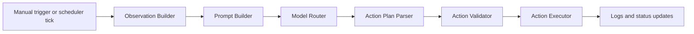

# AuTuber Specification

This document defines the product and architecture contract for the AuTuber desktop app.

AuTuber is a local-first desktop automation assistant for VTubers and streamers. It observes selected live context, requests a structured plan from a model provider, validates that plan locally, and executes only approved actions through supported integrations.

## Product Statement

AuTuber is designed to help creators stay expressive without handing raw control of their setup to a model.

The model suggests.

The app validates.

The operator remains in control.

## Launch Scope

The repository is targeting an initial desktop alpha with a strong VTube Studio loop and a growing OBS/control surface.

In-scope for the current launch track:

- Electron desktop app in `electron/`
- typed IPC bridge between renderer and main process
- local settings and secret storage
- VTube Studio connection, authentication, cataloging, and safe hotkey triggering
- capture ingestion for camera, screen, and audio
- model-provider routing for structured action-plan generation
- validation, cooldowns, confirmation rules, and structured logs

Explicitly not fully complete yet:

- unrestricted model-driven OBS automation
- production-grade cross-platform signing/distribution
- exhaustive operator analytics and review dashboards

## Repository Contract

```text
electron/  main product surface
docs/      source-of-truth documentation
models/    prompt and provider assets
apps/      future non-electron applications
packages/  future shared packages
scripts/   repo-level helpers
```

The Electron app must remain in `electron/`.

## Core Runtime Flow



Model-generated automation must not bypass this flow.

## Layer Boundaries

| Layer | Responsibilities |
|---|---|
| Main process | settings, secrets, capture orchestration, provider calls, validation, execution, logs |
| Renderer | setup, controls, settings UI, status, operator feedback |
| Preload | typed IPC contract only |
| Hidden capture window | browser media APIs and clip/frame sampling |
| Shared schemas/types | contracts for IPC, observations, config, and action plans |

Renderer code must communicate through the preload bridge only.

## Supported Action Families

Current supported action types:

- `vts.trigger_hotkey`
- `vts.set_parameter`
- `obs.set_scene`
- `obs.set_source_visibility`
- `overlay.message`
- `log.event`
- `noop`

Every action must include:

- `type`
- `actionId`
- `reason`

## Safety Contract

AuTuber never executes raw model text.

Before execution, the app must confirm:

- schema validity
- current integration state
- policy allowance
- autonomy-level allowance
- cooldown eligibility
- confirmation requirements for sensitive actions

Execution outcomes must be logged as executed, blocked, skipped, failed, or normalized to `noop`.

## Capture Contract

Capture is privacy-sensitive and defaults to safe behavior.

Required expectations:

- capture stays opt-in
- screen capture defaults off
- raw audio sending defaults off unless the operator enables it
- the operator can see and manage active capture sources
- hidden capture windows own browser media APIs, not the renderer or main UI code

## Integrations

### VTube Studio

Current strongest integration path.

The app supports:

- connect and disconnect
- authenticate plugin access
- load current-model hotkeys
- build a local automation catalog
- apply safe-auto filtering
- trigger approved hotkeys

### OBS

The app supports:

- connection state tracking
- scene/source visibility inventory
- AFK overlay helper behavior
- surfaced OBS actions in the validation layer

General model-driven OBS mutations remain confirmation-gated until the operator review workflow is stronger.

## Operator Experience Requirements

Features are not considered complete when they exist only in backend code.

For AuTuber, meaningful features should include:

- typed service logic
- validated IPC boundary
- settings/config support if user-facing
- an operator UI or explicit operational entry point
- logs or status visibility
- updated docs
- tests for non-trivial logic

## Documentation Requirements

The following docs are part of the product contract and should stay current:

- `docs/architecture.md`
- `docs/setup.md`
- `docs/security.md`
- `docs/apps/electron.md`
- `docs/features/automation-pipeline.md`
- `docs/features/capture.md`
- `docs/features/obs-integration.md`
- `docs/features/vts-integration.md`
- `docs/references/commands.md`
- `docs/references/repository-structure.md`
- `docs/references/releases.md`
- `docs/state/implementation-status.md`

## Verification Requirements

Before calling a change complete, run the relevant root commands:

```bash
pnpm lint
pnpm test
pnpm build
```

If a command cannot run in the environment, document the reason clearly.
