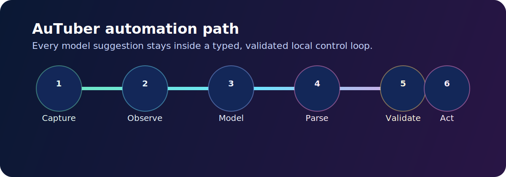
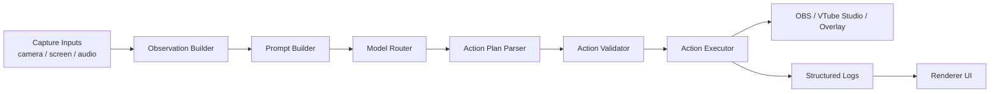
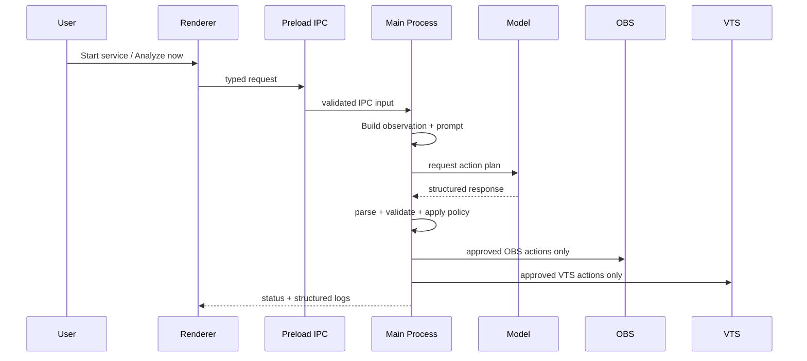
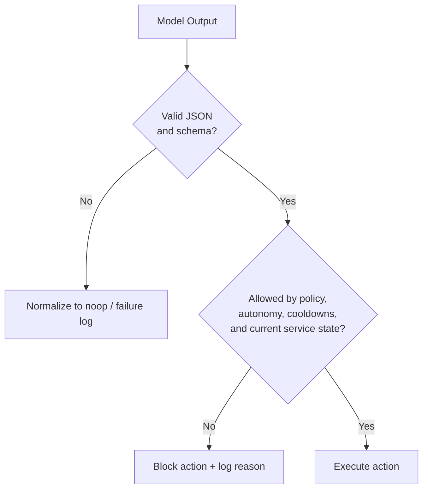

# Architecture

AuTuber is a local-first Electron app that watches streaming context, asks a model what to do next, and then executes only validated actions through privileged desktop integrations.

## At A Glance

## Layer Ownership

| Layer | Owns | Must Not Own |
|---|---|---|
| Electron main process | privileged services, settings, secrets, model calls, OBS/VTS clients, validation, execution | direct UI rendering |
| Preload bridge | typed, minimal IPC surface | business logic, secrets, direct network control |
| Renderer | setup, controls, status, configuration, logs | Node APIs, model providers, OBS/VTS clients, filesystem access |
| Hidden capture window | browser capture APIs, media sampling, clip creation | privileged automation decisions |
| Shared schemas/types | runtime contracts, typed boundaries, action definitions | side effects |

## Runtime Story

## Current Launch Slice

The repository is closest to an initial desktop alpha, not a fully generalized automation platform. Current documentation and release assets should be read with that scope in mind.

- Strongest path: VTube Studio connection, hotkey cataloging, safe-auto reaction triggering, live capture ingestion.
- Partial path: OBS context awareness, AFK overlay helpers, startup auto-retry behavior.
- Still maturing: generalized OBS automation confirmations, broader model-provider polish, full operator review tooling, linting beyond TypeScript checks.

## Safety Model

AuTuber is intentionally not a raw tool-calling agent.

Key rules:

- the renderer never executes privileged actions directly
- secrets stay in main-process services only
- IPC is always validated
- model text is never executed directly
- OBS actions remain confirmation-gated unless explicitly allowed by product rules

## Files That Matter Most

- `electron/src/main/services/automation/` for the canonical pipeline
- `electron/src/main/services/vts/` for hotkey catalog and execution logic
- `electron/src/main/services/obs/` for OBS state and action hooks
- `electron/src/main/services/settings/` for config and secret boundaries
- `electron/src/main/ipc/` for trusted renderer entry points
- `electron/src/renderer/` for operator-facing controls and visibility

## Related Docs

- [Setup](./setup.md)
- [Security](./security.md)
- [Electron App](./apps/electron.md)
- [Automation Pipeline](./features/automation-pipeline.md)
- [Repository Structure](./references/repository-structure.md)
