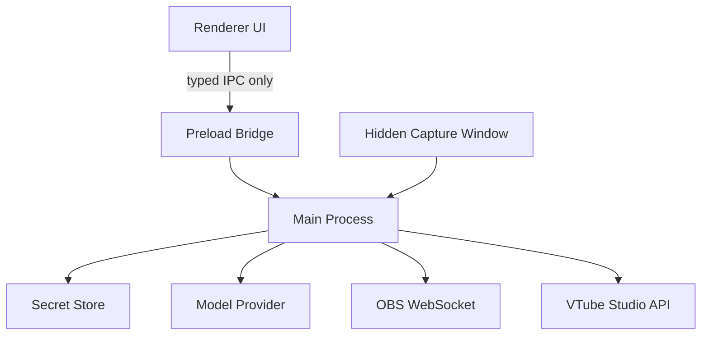

# Security

AuTuber handles desktop automation and third-party credentials, so the trust boundaries are a core product feature rather than an implementation detail.

## Security Principles

- renderer code is untrusted relative to the main process
- secrets never cross into the renderer
- every IPC boundary is validated with runtime schemas
- model output is advisory, not executable
- automation policy is enforced locally
- logs must stay useful without leaking secrets or raw private media

## Trust Boundaries

## Secret Handling

Secrets that must stay out of the renderer:

- model API keys
- OBS passwords
- VTube Studio auth tokens
- local API bearer tokens

Required behavior:

- store secrets only in main-process services
- redact secrets from logs and surfaced errors
- never place secrets in fixtures, screenshots, or sample responses

## Renderer Constraints

Renderer-safe modules must not import:

- Electron main-process services
- Node-only packages
- filesystem helpers
- OBS or VTS clients
- model provider clients

The preload bridge is the only allowed path.

## Model Safety

All model-generated actions must flow through:

`ModelRouter -> ActionPlanParser -> ActionValidator -> ActionExecutor`

AuTuber does not execute raw model text, arbitrary tool names, or unvalidated JSON.

## Logging Rules

Safe logs should capture:

- what stage failed
- what action was blocked or executed
- why a policy decision was made

Safe logs should not capture:

- full secrets
- raw camera frames
- raw microphone audio
- full private prompts if they contain sensitive user data

## Related Docs

- [Security Standard](./standards/security.md)
- [IPC Standard](./standards/ipc.md)
- [Action Plans](./standards/action-plans.md)
