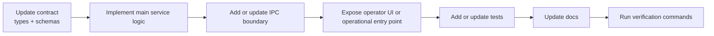

# Adding Features

This guide is the shortest safe path for adding a real AuTuber feature without breaking the product boundaries.

## Start Here

Read in this order:

1. `AGENTS.md`
2. `SPEC.md`
3. the relevant docs under `docs/`
4. nearby implementation files
5. nearby tests

Do not start by writing UI first and inventing the service later. AuTuber is boundary-driven.

## Decide What Kind Of Feature It Is

Use this split before touching code:

- renderer-only polish: loading states, layout, view copy, visual affordances
- IPC surface change: new operator action or new status/result shape
- privileged feature: model calls, OBS/VTS actions, secrets, filesystem, local API
- shared contract change: schemas, config, action types, observation shape

The answer determines where the first code change belongs.

## Standard Delivery Flow

## Required Checklist

### 1. Update The Contract

If the feature changes data shape, update:

- shared types
- Zod schemas
- default config if applicable
- typed IPC request/response contracts

Reject unknown fields at trust boundaries.

### 2. Put Privileged Logic In The Main Process

Main-process services own:

- settings and secrets
- model-provider calls
- OBS and VTube Studio clients
- action validation and execution
- filesystem or local API access

Renderer code must not import these directly.

### 3. Add An Operator Path

If the feature is user-configurable or operationally important, add at least one of:

- settings surface
- status/readiness surface
- manual trigger or test action
- structured logs
- documentation for operator usage

Backend-only capability is incomplete by project standard.

### 4. Preserve The Automation Pipeline

Model-generated behavior must still flow through:

`ModelRouter -> ActionPlanParser -> ActionValidator -> ActionExecutor`

Do not add shortcuts that execute model output directly.

### 5. Add Tests

For non-trivial features, add or update tests in the relevant area:

- schema tests
- service tests
- IPC validation tests
- pipeline integration tests with mocks

Never require live OBS, live VTube Studio, or a real model provider for unit tests.

### 6. Update Docs In The Same Change

Touch the smallest relevant doc:

- `docs/features/` for behavior
- `docs/standards/` for engineering rules
- `docs/references/` for commands and operational runbooks
- `docs/apps/` for app-level summaries

## Common Mistakes To Avoid

- adding a config field without updating defaults, schema, type, and UI
- leaking secrets through renderer state or logs
- passing raw external payloads into narrow helpers
- documenting future behavior as if it already ships
- adding a hidden feature with no visible management path

## Definition Of Done

A feature is done when:

- the implementation matches `SPEC.md`
- boundaries are preserved
- types and schemas agree
- the operator can use or verify it in practice
- docs are current
- tests are current
- verification commands were run or the blocker was documented
